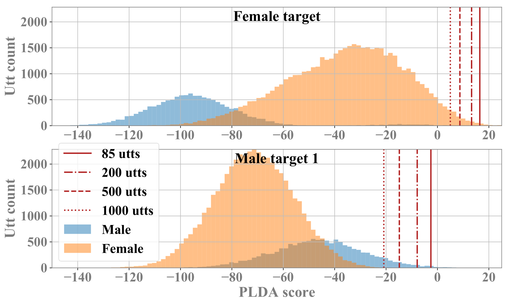

This page is the demo of 
"Relational Data Selection for Data Augmentation of Speaker-dependent Multi-band MelGAN Vocoder" [[paper](https://arxiv.org/abs/2007.12955)]

## **Abstract**  

 In this paper, we propose a data augmentation method based on speaker representation and similarity measurement of speaker verification. The proposed method (<b>DC1-3</b>) selects utterances that have similar speaker identity to the target speaker from an external corpus, and then combines the selected utterances with the limited target data for speaker-dependent (SD) vocoder adaptation. Compared with the vocoder adapted using only limited target data, the vocoder adapted using augmented data improves both the quality and similarity of synthesized speech. 

**Corpus and references:**  
[M2VoC in ICASSP2021](http://challenge.ai.iqiyi.com/detail?raceId=5fb2687724954e0b48431fdf)  
[MelGAN](https://arxiv.org/abs/1910.06711)  
[MelGAN_repo](https://github.com/kan-bayashi/ParallelWaveGAN)  

## **DC1**: Speaker similarity  

 To Select external utterances with similar speaker identities to the target speaker for speaker adaptation, we adopt <b>x-vector</b> speaker representation for identity modeling and the probabilistic linear discriminant analysis (<b>PLDA</b>) for similarity measurement. The <b>DC1</b> criterion is formulated as
 
$$ \mathrm{PLDA}(\boldsymbol{x}_{n, i},\boldsymbol{x}_{Target}), $$
 
where $\boldsymbol{x}$ denotes x-vector, $n$ is the candidate speaker index, $i$ is the utterance index, and $\boldsymbol{x}_{Target}$ is the average x-vector of all target utterances. The higher the PLDA score, the higher the speaker similarity. Furthermore, to make all PLDA scores have the same sign for the following criterion, temperature sigmoid is applied as
 
$$ \mathrm{PLDA}'(\cdot) = \frac{1}{1+0.5\times e^{-\mathrm{PLDA}(\cdot)}}. $$  

## **DC2**: DC1 + Speaker-wise divergence regularization  

 To regularize the utterance-wise x-vectors from the same speaker should be similar, an SD term is introduced to DC1, and the new <b>DC2</b> criterion is formulated as 
 
$$ \frac{\mathrm{PLDA}'(\boldsymbol{x}_{n, i},\boldsymbol{x}_{Target})}{(\sigma_n)^\alpha}, $$ 
 

where $\sigma_n$ is the square root of the average squared Euclidean distance between each utterance x-vector and the mean x-vector of speaker $n$, and the weight $\alpha$ is set to 0.1 in this paper. High x-vector diversity of a speaker results in low speaker similarity scores. 

## **DC3**: DC2 + Utterance-wise divergence regularization  

 To regularize the x-vector of an utterance should be similar to the x-vectors of other utterances of the same speaker, an utterance-wise regularizer is introduced to the denominator of DC2, and the new <b>DC3</b> criterion is formulated as 
 
$$\frac{\mathrm{PLDA}'(\boldsymbol{x}_{n, i},\boldsymbol{x}_{Target})}{(\sigma_n ||\boldsymbol{x}_{n, i}-\boldsymbol{u}_{n}||_{2})^\alpha}, $$
 
where $||{\cdot}||_{2}$ denotes the Euclidean distance (L2 norm), and $\boldsymbol{u}_{n}$ is the mean x-vector of speaker $n$. The larger the Euclidean distance, the lower the speaker similarity score. 

  
## **Demo Sounds**

|     | Female |
|:----|:------:|
|   Natural               | <audio src="res/audio/F1/Natural/T1S3000097.wav" controls preload></audio> | 
| SI *1        | <audio src="res/audio/F1/SI/T1S3000097_gen.wav" controls preload></audio> | 
| Adapt90 *2   | <audio src="res/audio/F1/Adapt90/T1S3000097_gen.wav" controls preload></audio> | 
| Adapt5 *3    | <audio src="res/audio/F1/Adapt5/T1S3000097_gen.wav" controls preload></audio> | 
| DC1 *4       | <audio src="res/audio/F1/DC1/T1S3000097_gen.wav" controls preload></audio> | 
| DC2 *5       | <audio src="res/audio/F1/DC2/T1S3000097_gen.wav" controls preload></audio> | 
| DC3 *6       | <audio src="res/audio/F1/DC3/T1S3000097_gen.wav" controls preload></audio> | 

*1. `SI: Speaker-independent baseline`   
*2. `Adapt90: Adaptation w/ 90 target utts `   
*3. `Adapt5: Adaptation w/ 5 target utts`    
*4. `DC1: Adaptation w/ 5 target utts + 85 DC1 selected utts`   
*5. `DC2: Adaptation w/ 5 target utts + 85 DC2 selected utts`   
*6. `DC3: Adaptation w/ 5 target utts + 85 DC3 selected utts`   
 
  

|     | Male 1 | Male 2 |
|:----|:------:|:------:|
|Natural  | <audio src="res/audio/M1/Natural/T1S4000099.wav" controls preload></audio> | <audio src="res/audio/M2/Natural/T1S5000095.wav" controls preload></audio> | 
| SI      | <audio src="res/audio/M1/SI/T1S4000099_gen.wav" controls preload></audio> | <audio src="res/audio/M2/SI/T1S5000095_gen.wav" controls preload></audio> | 
| Adapt90 | <audio src="res/audio/M1/Adapt90/T1S4000099_gen.wav" controls preload></audio> | <audio src="res/audio/M2/Adapt90/T1S5000095_gen.wav" controls preload></audio> | 
| Adapt5  | <audio src="res/audio/M1/Adapt5/T1S4000099_gen.wav" controls preload></audio> | <audio src="res/audio/M2/Adapt5/T1S5000095_gen.wav" controls preload></audio> | 
| DC1     | <audio src="res/audio/M1/DC1/T1S4000099_gen.wav" controls preload></audio> | <audio src="res/audio/M2/DC1/T1S5000095_gen.wav" controls preload></audio> |  
| DC2     | <audio src="res/audio/M1/DC2/T1S4000099_gen.wav" controls preload></audio> | <audio src="res/audio/M2/DC2/T1S5000095_gen.wav" controls preload></audio> |  
| DC3     | <audio src="res/audio/M1/DC3/T1S4000099_gen.wav" controls preload></audio> | <audio src="res/audio/M2/DC3/T1S5000095_gen.wav" controls preload></audio> |  
 
  

## **Experimental Results** 
- Objective evaluation

|           | SI      | Adapt90  | Adapt5 | DC1  | DC2  | DC3  |
|:----------|:-------:|:--------:|:------:|:----:|:----:|:----:|
|LSD (dB)   | 1.07    | **1.00** | 1.08   | 1.09 | 1.08 | 1.04 |
|MCD (dB)   | 6.36    | **5.43** | 5.96   | 6.06 | 6.03 | 6.08 | 
|$F_0$ (Hz) | 70.8    | **67.3** | 69.5   | 68.2 | 67.9 | 70.0 |
|$U/V$ (%)  | 15.6    | **13.7** | 14.9   | 15.1 | 14.9 | 14.7 |
|PLDA       | 33.2    | **39.5** | 29.0   | 34.8 | 32.6 | 33.6 |
|CosSim     | 0.82    | **0.88** | 0.81   | 0.84 | 0.84 | 0.84 |
 
  

- Subjective evaluation (MOS)

|          | Natural      | SI           | Adapt90          | Adapt5       | DC3          |
|:---------|:------------:|:------------:|:----------------:|:------------:|:------------:|
|Quality   | 4.96$\pm$.03 | 3.47$\pm$.14 | **3.71**$\pm$.13 | 2.65$\pm$.14 | 3.29$\pm$.13 |
|Similarity| -            | 3.57$\pm$.16 | **4.23**$\pm$.14 | 3.43$\pm$.16 | 3.71$\pm$.15 |  
  
  

## **PLDA score distributions of candidate utterances** 

  

 The score distributions for the female and the first male targets show the PLDA scores reflect the high correlation between gender and speaker similarity as expected. The selection thresholds of different utterance numbers imply the challenge to optimize the selection numbers because of the rapid PLDA score decrease for the increased selected utterances. 
 

  
[Home](https://bigpon.github.io/)

   
   